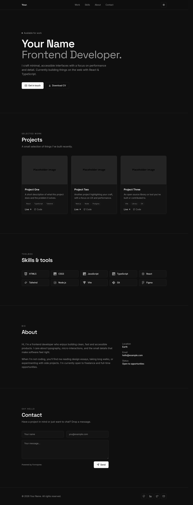

# Minimal Mono — Developer Portfolio Template

A clean, open-source portfolio template for developers. Built with **React + Vite + Tailwind CSS**. Dark by default with a one-tap light mode, fully responsive, scroll-reveal animations, and a single config file to make it yours in minutes.

> **Demo:** [Demo Url](https://modern-portofolio-template-omega.vercel.app/)

## Screenshot



## ✨ Features

- ⚡ React 18 + Vite 5 — instant HMR, blazing build
- 🎨 Tailwind CSS with a semantic design-token system (HSL)
- 🌗 Dark / light mode (defaults to dark, remembers preference)
- 📱 Fully responsive, mobile-first
- ✨ Smooth scroll-reveal animations (IntersectionObserver, no deps)
- 🧩 Sections: Hero · Projects · Skills · About · Contact · Footer
- 📨 Contact form wired to **Formspree** (mailto fallback)
- 🗂 All content in **one config file** — `src/data/config.ts`
- 🪶 Lightweight, accessible, SEO-friendly meta tags

## 🛠 Tech Stack

- [React 18](https://react.dev) · [TypeScript](https://www.typescriptlang.org/) · [Vite 5](https://vitejs.dev)
- [Tailwind CSS](https://tailwindcss.com) · [shadcn/ui primitives](https://ui.shadcn.com)
- [lucide-react](https://lucide.dev) + [react-icons](https://react-icons.github.io/react-icons/) for icons
- [Formspree](https://formspree.io) for the contact form

## 🚀 Getting Started

```bash
# 1. Clone
git clone https://github.com/your-username/minimal-mono-portfolio.git
cd minimal-mono-portfolio

# 2. Install
npm install

# 3. Run locally
npm run dev

# 4. Production build
npm run build
npm run preview
```

Open <http://localhost:8080>.

## ✏️ Customizing your content

Almost everything lives in **`src/data/config.ts`**. Edit that one file:

```ts
export const site = {
  name: "Jane Doe",
  role: "Frontend Developer",
  bio: "Short tagline about you…",
  email: "jane@example.com",
  location: "Tokyo, JP",
  cvUrl: "/cv.pdf",
  formspreeEndpoint: "https://formspree.io/f/abcdwxyz", // your Formspree form ID
};

export const projects = [
  {
    title: "Awesome App",
    description: "What it does and why it's cool.",
    tags: ["React", "Node", "Postgres"],
    image: "/projects/awesome.png",
    demo: "https://awesome.example.com",
    github: "https://github.com/jane/awesome",
  },
  // …add more
];

export const skills = [
  { name: "React", Icon: SiReact },
  // …pick more from react-icons/si
];

export const socials = [
  { name: "GitHub", href: "https://github.com/jane", Icon: FiGithub },
  // …
];
```

Other things you can replace:

- **CV** — drop your file at `public/cv.pdf` (overwrites the placeholder).
- **Project images** — put them in `public/projects/` and reference like `/projects/foo.png`.
- **Favicon / OG image** — `public/favicon.ico`, update `<meta property="og:image">` in `index.html`.
- **Theme colors** — tweak HSL tokens in `src/index.css` (`:root` and `.dark`).
- **Fonts** — change the `<link>` in `index.html` and the `fontFamily` keys in `tailwind.config.ts`.

## 📨 Setting up Formspree

1. Create a free account at <https://formspree.io>.
2. Create a new form — copy the endpoint (looks like `https://formspree.io/f/xyzabcd`).
3. Paste it into `site.formspreeEndpoint` in `src/data/config.ts`.

If you leave the placeholder endpoint, the form falls back to opening the user's mail client via `mailto:`.

## ☁️ Deploy

### Vercel

1. Push the repo to GitHub.
2. Go to <https://vercel.com/new>, import the repo.
3. Framework preset: **Vite**. Build command: `npm run build`. Output: `dist`.
4. Click **Deploy**. Done — every push to `main` redeploys.

### Netlify

1. Push the repo to GitHub.
2. Go to <https://app.netlify.com/start>, pick the repo.
3. Build command: `npm run build`. Publish directory: `dist`.
4. Click **Deploy site**.

For SPA routing (if you add routes), add `public/_redirects`:

```
/*   /index.html   200
```

## 📁 Project Structure

```
src/
├─ components/      # Hero, Projects, Skills, About, Contact, Footer, Navbar
├─ pages/           # Index, NotFound
├─ hooks/           # useTheme, useReveal
├─ data/
│  └─ config.ts     # 👈 EDIT ME — your personal data
├─ lib/             # utilities
├─ index.css        # design tokens (HSL)
└─ main.tsx
public/
├─ cv.pdf           # replace with your CV
├─ favicon.ico
└─ placeholder.svg
```

## 📄 License

[MIT](./LICENSE) — free for personal and commercial use. Attribution appreciated but not required.

## 🙏 Credits

- Design system inspired by minimal-mono portfolio aesthetics
- Icons by [Lucide](https://lucide.dev) & [Simple Icons](https://simpleicons.org) (via react-icons)
- Fonts: [Space Grotesk](https://fonts.google.com/specimen/Space+Grotesk) + [Inter](https://fonts.google.com/specimen/Inter)

If you ship a site with this template, a link back to the repo is a lovely gesture 💜
